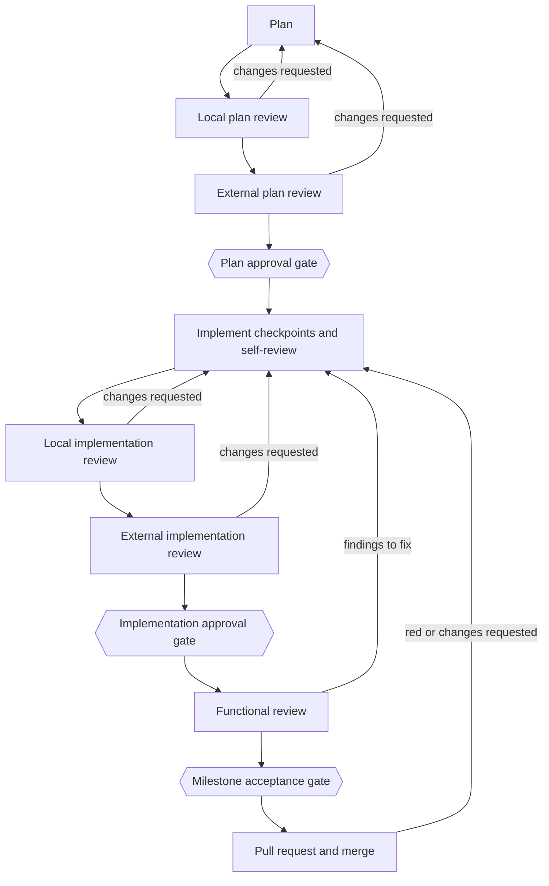

# How the Workflow works

> For: anyone who wants the big picture. Last checked with: Workflow 2.8.0, Workflow Manager 1.4.0.

The Workflow guides one piece of work, a **work item**, from idea to merged
pull request. You can read this page without knowing any code.

## Lifecycle

The three hexagons are the **approval gates**. Each one is either
automatic (the Workflow passes it once its evidence is complete) or needs a
person, as the repository's [gate policy](gates.md) says. The default is
automatic.

## The steps

1. **Plan.** The agent reads the roadmap, drafts a plan split into checkpoints
   and reviews it itself (`/milestone-plan`).
2. **Local plan review.** The first review stage checks the plan
   (`/review-plan`). If it asks for changes, the plan is revised
   (`/apply-plan-review`) and reviewed again.
3. **External plan review.** An independent reviewer, usually another AI model
   family or a person, reviews the same plan bundle. The verdict is recorded
   (`/record-manual-plan-review`).
4. **Plan approval gate.** The plan is approved, and the approval is tied to
   exactly the content that was reviewed.
5. **Implement checkpoints.** The agent builds the plan one checkpoint at a
   time (`/milestone-implement`), committing each one, and then reviews its own
   whole diff and runs the tests.
6. **Local implementation review.** The same kind of local review, now on the
   code (`/review-implementation`). Changes requested go through
   `/apply-implementation-review`.
7. **External implementation review.** An independent review of the code,
   recorded with `/record-manual-implementation-review`.
8. **Implementation approval gate.** Also called technical approval. Any
   change to the reviewed code after this point makes the approval stale.
9. **Functional review.** The work is checked against real behavior. A
   checklist is prepared (`/prepare-functional-review`); findings are fixed
   with `/apply-functional-review`.
10. **Milestone acceptance gate.** The work item is accepted as done.
11. **Pull request and merge.** The work lands as one pull request, merged by
    squash. If the pull request turns red or gets changes requested, the same
    work item is reopened for fixes (`/apply-pr-review`).

Note on step 10 and 11: when acceptance is automatic, the pull request must
already be open and pushed, because the Workflow reads the checks from GitHub.
See [approval gates](gates.md).

If the plan must change after it was approved, a person can request an
amendment (`/request-plan-amendment`), and the plan goes through review again.

## Who does what

| Who | What they do |
| --- | --- |
| The person | Chooses the gate policy. Passes any gate that is set to human approval (`/approve-review`, `/accept-milestone`). Is the only one who can loosen the gate policy (`/adopt-gate-policy`). |
| The agent or orchestrator | Plans, implements, applies review feedback, prepares bundles and checklists. When a gate is automatic, runs `/satisfy-gate` to pass it from evidence. The [Workflow Controller](https://github.com/RodrigoFAbreu/workflow-controller#readme) is an orchestrator that does this automatically. |
| The reviewers | The local reviewer and the independent external reviewer each give a verdict: approve, revise or block. They never pass a gate themselves. |

## Where to go next

- [Approval gates](gates.md) for the details of each gate.
- [Glossary](glossary.md) for the terms.
- The shipped state machine, with every phase:
  [MILESTONE_WORKFLOW.md](https://github.com/RodrigoFAbreu/workflow/blob/main/payload/docs/ai-workflow/MILESTONE_WORKFLOW.md).
